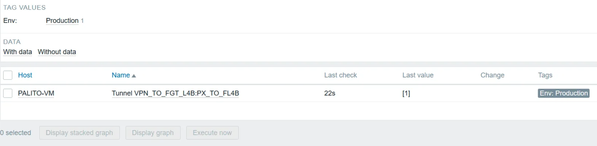

# Palo Alto VPN IPSec Monitoring Template

This repository contains a Zabbix template for monitoring IPSec tunnels on Palo Alto devices. The template provides a comprehensive solution for monitoring VPN tunnel status and integrates seamlessly with Grafana.

## Features
- **Automatic discovery of VPN tunnels**.
- **Monitoring tunnel states**: `active`, `inactive`, `init`.
- **Numeric values for easier Grafana integration**.
- **Preconfigured triggers to alert on tunnel issues**.
- **Custom valuemap for more user-friendly visualizations**.

## Requirements
- **Zabbix 6.4 or later**.
- Palo Alto device with API access configured.
- Palo Alto API key stored as a macro in Zabbix (`{$PAN_API_KEY}`).

## Installation
1. **Import the Template**
   - Go to `Configuration > Templates` in Zabbix.
   - Click on `Import`.
   - Select the `PaloAlto-VPN-IPSec-Template.yaml` file and click `Import`.

2. **Configure the Host**
   - Link the template to the corresponding host.
   - Configure the required macros:
     - `{$PAN_API_KEY}`: API key for the Palo Alto device.
     - `{HOST.CONN}`: IP address or hostname of the device.

3. **Test the Setup**
   - Verify that data items are collecting information correctly.
   - Ensure that VPN tunnels are being automatically discovered.

## Grafana Integration
1. Ensure Grafana has access to the Zabbix server.
2. Use the key `vpn.ipsec.state.[{#TUNNEL.NAME}]` to create custom visualizations and panels.

## Screenshot

## Contributing
Contributions are welcome. Open an issue or submit a pull request to improve this project.

## License
This project is licensed under the MIT License. See the `LICENSE` file for details.
