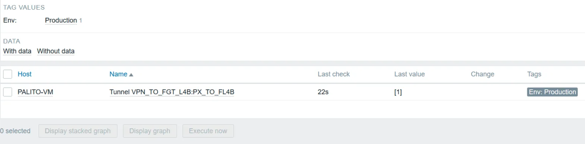

# Usage Guide: Palo Alto VPN IPSec Monitoring Template

This document provides step-by-step instructions on how to set up and use the **Palo Alto VPN IPSec Monitoring Template** with Zabbix.

---

## 1. Prerequisites

Before importing and using the template, ensure the following:

- **Zabbix Server**:
  - Version 6.4 or later.
- **Palo Alto Device**:
  - API access enabled.
  - Obtain an API key (explained below).
- **Macros**:
  - `{$PAN_API_KEY}`: The API key generated for the Palo Alto device.
  - `{HOST.CONN}`: The device's hostname or IP address.

---

## 2. Setting Up the Palo Alto API Key

To generate an API key for your Palo Alto device:

1. Log in to the Palo Alto Web Interface.
2. Navigate to **Device > Management > Administrators**.
3. Add or edit an administrator account with the required permissions for API access.
4. Generate the API key:
   - Send a request to the following URL in a browser or tool like Postman:
     ```
     https://<PALO_ALTO_IP>/api/?type=keygen&user=<USERNAME>&password=<PASSWORD>
     ```
   - The response will include the API key. Copy it for later use.

---

## 3. Importing the Template into Zabbix

1. Log in to the Zabbix frontend.
2. Navigate to **Configuration > Templates**.
3. Click on the **Import** button.
4. Select the `PaloAlto-VPN-IPSec-Template.yaml` file from this repository.
5. Click **Import**.

---

## 4. Configuring the Host

1. Go to **Configuration > Hosts**.
2. Create a new host or edit an existing one.
3. Add the Palo Alto device's hostname or IP address under the **Interfaces** section.
4. Link the imported template (`Palo Alto VPN IPSec Tunnels Status`) to the host.
5. Define the required macros:
   - **`{$PAN_API_KEY}`**: Set the API key obtained earlier.
   - **`{HOST.CONN}`**: Set the hostname or IP address of the device.

---

## 5. Verifying Data Collection

1. Wait a few minutes for data to be collected.
2. Navigate to **Monitoring > Latest Data**.
3. Filter by the host to ensure the following:
   - The `vpn.status` item retrieves the raw JSON response.
   - Discovered VPN tunnels appear as items like `vpn.ipsec.state.[TunnelName]`.

---

## 6. Customizing Triggers

The template includes preconfigured triggers to monitor tunnel states:
- **High priority** alert for tunnels in a `Down` (inactive) state.

To customize:
1. Go to **Configuration > Hosts**.
2. Select the host linked to the template.
3. Edit the triggers to modify expressions, severities, or notification settings.

---

## 7. Grafana Integration (Optional)

1. Install the Zabbix plugin for Grafana.
2. Configure a Zabbix data source in Grafana.
3. Create a dashboard using the discovered items:
   - Use keys like `vpn.ipsec.state.[{#TUNNEL.NAME}]` for visualizing tunnel states.
4. Map the numeric values:
   - `1` → `Up`.
   - `0` → `Down`.
   - `2` → `Init`.

---

## 8. Troubleshooting

### Issue: No Data Collected
- Verify the API key is correct.
- Ensure the Zabbix server can reach the Palo Alto device (check firewalls and network configurations).

### Issue: VPN Tunnels Not Discovered
- Confirm the Palo Alto device has VPN tunnels configured.
- Check the template's discovery rule under **Configuration > Hosts > Discovery Rules**.

### Issue: Grafana Displays Text Instead of Numeric Values
- Ensure the `JAVASCRIPT` preprocessing step converts states to numeric values.
- Confirm that value mappings are applied in Grafana.

---

## Example Dashboard

Below is an example of a Grafana dashboard displaying tunnel states:



---

By following these steps, you should be able to set up, monitor, and visualize Palo Alto VPN IPSec tunnels efficiently. If you encounter any issues, feel free to open an issue in the repository! 🚀
